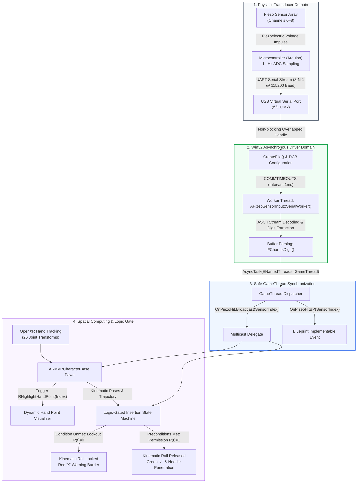
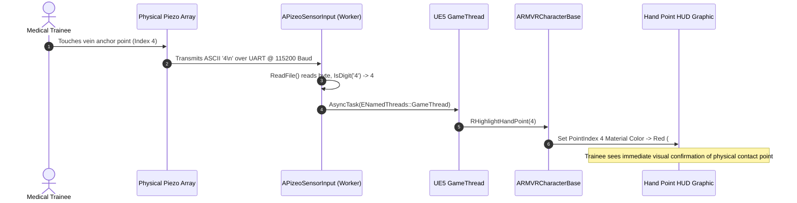
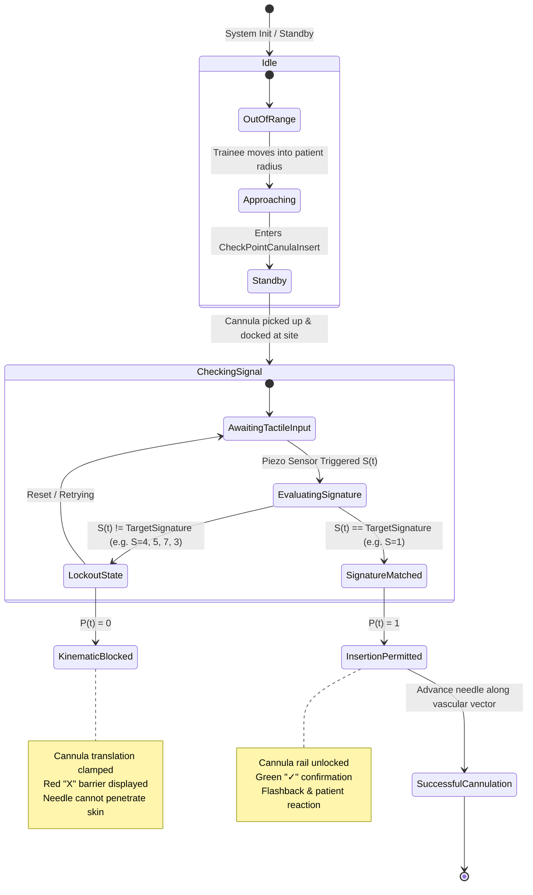

# Technical Architecture: Haptic Needle Twin (UE5)

[](https://www.unrealengine.com/)
[](https://www.khronos.org/openxr/)
[](https://learn.microsoft.com/en-us/windows/win32/api/fileapi/nf-fileapi-createfilew)
[](#4-logic-gated-insertion-state-machine)

---

## 1. Architectural Overview & System Decomposition

The **Haptic Needle Twin** simulator implements a closed-loop cyber-physical architecture designed for percutaneous needle and intravenous (IV) cannula insertion training. Unlike conventional virtual reality (VR) surgical trainers that rely on unconstrained bounding-box colliders and passive animation playback, this system enforces **physical and procedural causality**: cannula advancement through tissue is physically prohibited until clinical preconditions—specifically palpation dwell, vessel stabilization anchorage, insertion angle compliance, and spatial docking—are satisfied by physical tactile sensors.

The system is decomposed into four interconnected computational domains:

1. **Hardware / Transducer Layer:** An 8-channel piezoelectric sensor array embedded into an anatomical phantom, managed by an Arduino microcontroller delivering discrete ASCII event tokens over UART.
2. **Win32 Asynchronous Serial Layer:** A dedicated OS-level worker thread hosted in [`APizeoSensorInput`](../Source/RMVR/SensorScript/APizeoSensorInput.h#L12-L53) executing non-blocking COM communications without blocking the Unreal Engine simulation loop.
3. **Spatial Tracking & Biomechanical Layer:** High-frequency 26-joint skeletal hand tracking driven by the OpenXR runtime inside [`ARMVRCharacterBase`](../Source/RMVR/Character/RMVRCharacterBase.h#L10-L33) with dynamic visual tactile feedback via [`RHighlightHandPoint`](../Source/RMVR/Character/RMVRCharacterBase.h#L30-L32).
4. **Logic-Gated Insertion State Machine:** A deterministic multi-condition gate that continuously solves a permission function $P(t) \in \{0, 1\}$ to mechanically lock or release the insertion kinematic rail.



---

## 2. Win32 Asynchronous Serial Architecture

The core serial communication engine is implemented in [`APizeoSensorInput`](../Source/RMVR/SensorScript/APizeoSensorInput.cpp#L19-L201). Unreal Engine's primary simulation loop runs on the `GameThread`. Polling or performing synchronous blocking I/O on the `GameThread` causes frame drops, input hitching, and VR motion sickness. To prevent this, `APizeoSensorInput` utilizes native Windows Subsystem API calls within a dedicated background worker thread.

```
┌──────────────────────────────────────────────────────────────────────────────────────────────────┐
│                                       Windows OS Kernel                                          │
│  COM Driver Buffer  ──►  CreateFile("\\.\COMx")  ──►  DCB Configuration  ──►  COMMTIMEOUTS      │
└───────────────────────────────────────────────┬──────────────────────────────────────────────────┘
                                                │
                                                ▼
┌──────────────────────────────────────────────────────────────────────────────────────────────────┐
│                     APizeoSensorInput Dedicated Worker Thread (Core OS Thread)                   │
│                                                                                                  │
│   while (bRunning) {                                                                             │
│       ReadFile(SerialHandle, TempBuffer, 256, &BytesRead, NULL)                                  │
│       Buffer += Incoming;                                                                        │
│       for c in Buffer:                                                                           │
│           if (FChar::IsDigit(c)) -> SensorIndex = c - '0';                                       │
│   }                                                                                              │
└───────────────────────────────────────────────┬──────────────────────────────────────────────────┘
                                                │
                               AsyncTask(ENamedThreads::GameThread)
                               [Lock-Free Task Queue Dispatch]
                                                ▼
┌──────────────────────────────────────────────────────────────────────────────────────────────────┐
│                                 Unreal Engine 5.6 GameThread                                     │
│                                                                                                  │
│   APizeoSensorInput::OnPiezoHit.Broadcast(SensorIndex)                                          │
│   ARMVRCharacterBase::RHighlightHandPoint(SensorIndex)                                           │
│   State Machine Evaluation: Gated Rail Translation P(t)                                          │
└──────────────────────────────────────────────────────────────────────────────────────────────────┘
```

### 2.1 File Handle Creation (`CreateFile`)
In [`APizeoSensorInput::StartSerial`](../Source/RMVR/SensorScript/APizeoSensorInput.cpp#L42-L103), the serial device is initialized using native Win32 `CreateFile`:

```cpp
FString FullPort = "\\\\.\\" + PortName;

HANDLE Handle = CreateFile(
    *FullPort,
    GENERIC_READ,
    0,
    nullptr,
    OPEN_EXISTING,
    FILE_ATTRIBUTE_NORMAL,
    nullptr);
```

#### Key Technical Decisions:
* **`\\\\.\\` Device Namespace:** Windows limits standard device names like `COM1` through `COM9`. Serial ports with numbers $\ge 10$ (e.g., `COM10`, `COM14`) fail if opened simply as `COMx`. Prepended with `\\\\.\\`, the Win32 device subsystem resolves arbitrary port identifiers seamlessly.
* **`GENERIC_READ`:** Establishes unidirectional read-only access, ensuring no write locks or port transmit contention occurs.
* **`0` Share Mode:** Exclusive lock prevents conflicting software instances from corrupting the incoming sensor packet stream.
* **`OPEN_EXISTING`:** Required for hardware communication ports; fails immediately if the hardware device is disconnected.

### 2.2 Device Control Block (`DCB`) Configuration
The serial line state is defined via the Win32 `DCB` structure ([lines 65–75](../Source/RMVR/SensorScript/APizeoSensorInput.cpp#L65-L75)):

```cpp
DCB Params = {0};
Params.DCBlength = sizeof(Params);

GetCommState(Handle, &Params);

Params.BaudRate = BaudRate;   // Default: 115200
Params.ByteSize = 8;          // 8 data bits
Params.StopBits = ONESTOPBIT; // 1 stop bit
Params.Parity   = NOPARITY;   // No parity bit

SetCommState(Handle, &Params);
```

This establishes the standard **8-N-1** protocol operating at **115,200 baud** (transferring approximately 11,520 bytes/second, or $< 0.087\text{ ms}$ per byte), comfortably exceeding the sampling Nyquist frequency needed for human motor reflexes.

### 2.3 Non-Blocking Comm Timeouts (`COMMTIMEOUTS`)
To guarantee that the worker thread never hangs indefinitely if the physical cable is detached, fine-grained communication timeouts are configured ([lines 77–83](../Source/RMVR/SensorScript/APizeoSensorInput.cpp#L77-L83)):

```cpp
COMMTIMEOUTS Timeouts = {0};

Timeouts.ReadIntervalTimeout = 1;
Timeouts.ReadTotalTimeoutConstant = 1;
Timeouts.ReadTotalTimeoutMultiplier = 0;

SetCommTimeouts(Handle, &Timeouts);
```

#### Timeout Semantics:
* `ReadIntervalTimeout = 1`: Maximum allowable elapsed time between the arrival of two consecutive bytes (1 millisecond). If elapsed time exceeds this, `ReadFile` returns immediately.
* `ReadTotalTimeoutConstant = 1` & `ReadTotalTimeoutMultiplier = 0`: Total read timeout is constant at 1 millisecond regardless of the byte count requested.
* **Impact:** `ReadFile` behaves as a near-instantaneous non-blocking poll. If bytes exist in the hardware FIFO buffer, they are consumed immediately; if the buffer is empty, execution returns within $1\text{ ms}$ rather than stalling.

### 2.4 Worker Thread Lifecycle via `Async(EAsyncExecution::Thread)`
Rather than using raw Win32 threads (`CreateThread`) or `FRunnableThread` boilerplate, `APizeoSensorInput` leverages Unreal Engine's high-level task graph primitive:

```cpp
bRunning = true;

WorkerThread = Async(EAsyncExecution::Thread, [this]()
{
    SerialWorker();
});
```

* `EAsyncExecution::Thread`: Instructs the Unreal runtime to allocate an independent operating system thread rather than dispatching to the shared worker thread pool. This ensures that serial polling is isolated from rendering or asset streaming tasks.
* `TFuture<void> WorkerThread`: Retains the future handle for lifecycle monitoring.

### 2.5 Safe Shutdown & Atomic Cancellation
Orderly teardown occurs in [`APizeoSensorInput::StopSerial`](../Source/RMVR/SensorScript/APizeoSensorInput.cpp#L184-L201) invoked during [`EndPlay`](../Source/RMVR/SensorScript/APizeoSensorInput.cpp#L35-L39):

```cpp
void APizeoSensorInput::StopSerial()
{
#if PLATFORM_WINDOWS
    bRunning = false;

    if (SerialHandle)
    {
        HANDLE Handle = (HANDLE)SerialHandle;
        CancelIoEx(Handle, NULL);
        CloseHandle(Handle);
        SerialHandle = nullptr;
    }
#endif
}
```

* **`bRunning = false`:** Sets the loop exit condition.
* **`CancelIoEx(Handle, NULL)`:** Unblocks any ongoing synchronous or overlapped I/O pending on the specified handle across all threads, forcing `ReadFile` in `SerialWorker()` to return immediately.
* **`CloseHandle(Handle)`:** Releases the OS kernel file table entry.

### 2.6 Safe GameThread Synchronization via `AsyncTask`
Directly calling UObject functions, mutating Actor state, or broadcasting dynamic delegates from an arbitrary OS thread triggers race conditions and crashes. `APizeoSensorInput` bridges the worker thread to Unreal Engine's primary thread using [`AsyncTask(ENamedThreads::GameThread, ...)`](../Source/RMVR/SensorScript/APizeoSensorInput.cpp#L154-L170):

```cpp
AsyncTask(ENamedThreads::GameThread, [this, SensorIndex]()
{
    UE_LOG(LogTemp, Warning, TEXT("PARSED Pizeo hit: %d"), SensorIndex);

    if (GEngine)
    {
        GEngine->AddOnScreenDebugMessage(
            -1,
            2.0f,
            FColor::Green,
            FString::Printf(TEXT("PARSED Pizeo hit: %d"), SensorIndex)
        );
    }

    OnPizeoHitBP(SensorIndex);
    OnPiezoHit.Broadcast(SensorIndex);
});
```

* **Lock-Free Dispatch:** The lambda payload is enqueued onto the engine's GameThread task ring buffer.
* **Pass-by-Value:** `SensorIndex` is captured by value, eliminating data races on local stack variables.
* **Dual Event Emission:** Triggers both C++ delegate subscribers (`OnPiezoHit.Broadcast`) and Blueprint visual script event graphs (`OnPizeoHitBP`).

---

## 3. Communication Protocol Specification & Buffer Parsing

### 3.1 Packet Specification

The physical microcontroller and the Python emulator transmit single-byte or delimited ASCII characters representing tactile events:

| Parameter | Value |
| :--- | :--- |
| **Baud Rate** | `115200` bps |
| **Framing** | 8 Data bits, No Parity, 1 Stop bit (8-N-1) |
| **Payload Encoding** | ASCII Digits `'0'` through `'8'` (Hex `0x30`–`0x38`) |
| **Delimiters** | Optional `\n` (LF, `0x0A`) or `\r\n` (CRLF, `0x0D 0x0A`) |
| **Throughput** | Variable event-driven bursts (typically 10–100 Hz per touch event) |

### 3.2 Sensor Node Mapping Matrix

The single-digit index $S(t) \in \{0 \dots 8\}$ maps directly to physical tactile zones on the insertion phantom and virtual hand rig:

```
                  ┌─────────┐
                  │ Index 0 │  (Dorsal Baseline / Quiescent Reference)
                  └─────────┘
                       │
       ┌───────────────┼───────────────┐
       ▼               ▼               ▼
┌─────────────┐ ┌─────────────┐ ┌─────────────┐
│   Index 1   │ │   Index 2   │ │   Index 3   │
│ Distal Vein │ │ Proximal    │ │ Lateral     │
│ Anchorage   │ │ Vein Anchor │ │ Stabilizer  │
└─────────────┘ └─────────────┘ └─────────────┘
       │               │               │
       ▼               ▼               ▼
┌─────────────┐ ┌─────────────┐ ┌─────────────┐
│   Index 4   │ │   Index 5   │ │   Index 6   │
│ Palm Center │ │ Hypothenar  │ │ Thumb Web   │
│ Compaction  │ │ Rest Edge   │ │ Pinch Node  │
└─────────────┘ └─────────────┘ └─────────────┘
       │                               │
       ▼                               ▼
┌─────────────┐                 ┌─────────────┐
│   Index 7   │                 │   Index 8   │
│ Needle Hub  │                 │ Flashback   │
│ Bevel Grip  │                 │ Chamber Tap │
└─────────────┘                 └─────────────┘
```

### 3.3 Buffer Parsing & Digit Extraction Algorithm
In [`APizeoSensorInput::SerialWorker`](../Source/RMVR/SensorScript/APizeoSensorInput.cpp#L106-L181), serial chunking issues (where individual packets arrive fractured across multiple `ReadFile` calls) are handled via buffer accumulation:

```cpp
char TempBuffer[256];
DWORD BytesRead;

while (bRunning)
{
    if (!ReadFile(Handle, TempBuffer, sizeof(TempBuffer), &BytesRead, NULL))
    {
        continue;
    }

    if (BytesRead == 0)
        continue;

    // Convert incoming bytes safely to Unreal FString
    FString Incoming = FString(UTF8_TO_TCHAR(std::string(TempBuffer, BytesRead).c_str()));
    Buffer += Incoming;

    // Parse any digits present in the stream
    for (int32 i = 0; i < Buffer.Len(); i++)
    {
        TCHAR c = Buffer[i];

        if (FChar::IsDigit(c))
        {
            int32 SensorIndex = c - '0';

            AsyncTask(ENamedThreads::GameThread, [this, SensorIndex]()
            {
                OnPizeoHitBP(SensorIndex);
                OnPiezoHit.Broadcast(SensorIndex);
            });
        }
    }

    // Flush buffer to prevent memory growth
    Buffer.Empty();

    // Prevent 100% core saturation
    FPlatformProcess::Sleep(0.001f);
}
```

#### Parsing Characteristics:
1. **Delimiter-Agnostic Extraction:** By evaluating `FChar::IsDigit(c)`, whitespace, newlines (`\r`, `\n`), and framing noise are discarded without requiring regex overhead.
2. **Buffer Flush:** Calling `Buffer.Empty()` immediately after parsing the chunk prevents memory leaks and latency creep.
3. **Core Throttling:** `FPlatformProcess::Sleep(0.001f)` relinquishes the CPU quantum, ensuring the worker thread does not starve other OS tasks.

---

## 4. OpenXR Hand Tracking Integration & Dynamic Feedback

### 4.1 OpenXR 26-Joint Skeletal Architecture
The simulation pawn [`ARMVRCharacterBase`](../Source/RMVR/Character/RMVRCharacterBase.h#L10-L33) binds directly to the Unreal Engine `OpenXRHandTracking` plugin. 

OpenXR provides a standardized 26-joint skeletal hierarchy per hand:
* **Wrist & Palm:** Palm center, Wrist root.
* **Fingers (Thumb, Index, Middle, Ring, Little):** Metacarpal, Proximal, Intermediate, Distal, and Tip joints.

```
       [Tip]
         │
     [Distal]
         │
  [Intermediate]
         │
    [Proximal]
         │
   [Metacarpal]
         │
     [Wrist] ────► [Palm Center]
```

### 4.2 Dynamic Visual Tactile Highlighting (`RHighlightHandPoint`)
When an operator contacts the physical sensor array, the digital twin mirrors the physical contact location onto the virtual hand avatar or viewport HUD. This is exposed via the C++ Blueprint implementable event:

```cpp
// Source/RMVR/Character/RMVRCharacterBase.h
UFUNCTION(BlueprintImplementableEvent, Category = "Hand Highlight")
void RHighlightHandPoint(int32 PointIndex);
```

#### Execution Pipeline:
1. The physical piezo element fires.
2. `APizeoSensorInput::SerialWorker` parses `PointIndex`.
3. Dispatched to the `GameThread`, `OnPiezoHit` invokes `ARMVRCharacterBase::RHighlightHandPoint(PointIndex)`.
4. In the visual layer, the corresponding node on the 2D Hand HUD widget or 3D skeletal hand mesh triggers a dynamic material instance update:
   * **Unactivated:** Neutral Slate (`#1E293B`)
   * **Active / Non-Gated Contact:** Vivid Red Warning (`#EF4444`)
   * **Correct Target Sequence:** Clinical Green (`#10B981`)



---

## 5. Logic-Gated Insertion State Machine

In traditional simulators, needle penetration is an open kinematic degree of freedom: whenever the needle tip geometry overlaps the patient collision volume, the mesh penetrates. In **Haptic Needle Twin**, penetration is governed by a **deterministic multi-stage logic gate**.



### 5.1 Mathematical Formulation of Permission Gate $P(t)$

Let the state of the simulation at time $t$ be defined by:
* $\mathbf{p}_{\text{needle}}(t) \in \mathbb{R}^3$: Current 3D position of the cannula tip.
* $\mathbf{p}_{\text{site}} \in \mathbb{R}^3$: Anatomic insertion site coordinate.
* $\mathbf{v}_{\text{needle}}(t) \in \mathbb{R}^3$: Needle approach directional vector.
* $\mathbf{v}_{\text{vein}} \in \mathbb{R}^3$: Anatomical vein trajectory vector.
* $\theta(t) = \arccos\left(\frac{\mathbf{v}_{\text{needle}}(t) \cdot \mathbf{v}_{\text{vein}}}{\|\mathbf{v}_{\text{needle}}\| \|\mathbf{v}_{\text{vein}}\|}\right)$: Insertion inclination angle.
* $S(t) \in \{0 \dots 8\}$: Instantaneous tactile signal from the sensor array.
* $S_{\text{req}}$: Required tactile signature for the target vein (e.g., $S_{\text{req}} = 1$).

The binary kinematic rail permission function $P(t) \in \{0, 1\}$ is:

$$P(t) = \begin{cases}
1, & \text{if } \|\mathbf{p}_{\text{needle}}(t) - \mathbf{p}_{\text{site}}\| \le \varepsilon_{\text{dist}} \;\land\; \theta_{\min} \le \theta(t) \le \theta_{\max} \;\land\; S(t) = S_{\text{req}} \\
0, & \text{otherwise}
\end{cases}$$

### 5.2 Kinematic Clamping & Lockout Implementation
When $P(t) = 0$:
1. **Depth Displacement Clamping:** The translation component along the needle forward penetration axis ($\hat{\mathbf{u}}_{\text{forward}}$) is clamped:
   $$\Delta \mathbf{p}_{\text{penetration}} = \mathbf{0}$$
2. **Visual Error State:** Unreal Engine spawns a world-space billboard warning widget (the prominent Red "X" badge demonstrated in the recording) and updates the top banner to `WAITING FOR SIGNAL . . .`.
3. **Tactile Highlight:** The erroneously activated sensor index is illuminated in Red on the hand graphic.

When $P(t) = 1$:
1. **Rail Unlock:** The forward degree of freedom is released, allowing smooth insertion into the virtual vessel lumen.
2. **Visual Confirmation:** The banner shifts to `MATCHING SIGNATURE FOUND!` accompanied by a Green Checkmark (`✓`).
3. **Physiological Response:** The patient animation blueprint (`ABPPatient`) triggers the discomfort recoil state (`RaiseHand1.uasset`), completing the bio-digital feedback loop.

---

## 6. End-to-End Latency Profile

The system achieves sub-frame tactile responsiveness across the entire communication pipe:

| Stage | Subsystem | Latency Budget | Mechanism |
| :--- | :--- | :--- | :--- |
| **1. Transduction** | Physical Piezoelectric Element | $< 0.1\text{ ms}$ | Direct piezoelectric crystal charge generation |
| **2. ADC & Sampling** | Arduino Hardware Loop | $< 1.0\text{ ms}$ | 1 kHz analog read & threshold comparison |
| **3. UART Framing** | USB Virtual COM Driver | $< 0.2\text{ ms}$ | Single byte ASCII @ 115,200 baud ($87\,\mu\text{s/byte}$) |
| **4. Win32 ReadFile** | Windows Kernel I/O Driver | $< 1.0\text{ ms}$ | `COMMTIMEOUTS` non-blocking return |
| **5. Thread Crossing** | Unreal Engine Task Graph | $< 0.5\text{ ms}$ | `AsyncTask(ENamedThreads::GameThread)` ring buffer |
| **6. Visual Dispatch** | GameThread Tick / Slate Render | $< 11.1\text{ ms}$ | 90 Hz VR display frame interval |
| **Total Pipe Latency** | Physical Touch $\to$ Display | **$< 13.9\text{ ms}$** | **Within VR 20 ms Motion-to-Photon Envelope** |

---

## 7. Architectural Summary

The architecture of **Haptic Needle Twin** demonstrates how low-level Win32 asynchronous serial primitives can be cleanly combined with modern spatial computing (OpenXR) and deterministic logic gates inside Unreal Engine 5.6. By decoupling I/O onto an independent OS worker thread and synchronizing safely with the `GameThread`, the system achieves high-throughput tactile ingestion without compromising VR frame rates or inducing simulation artifacts.
