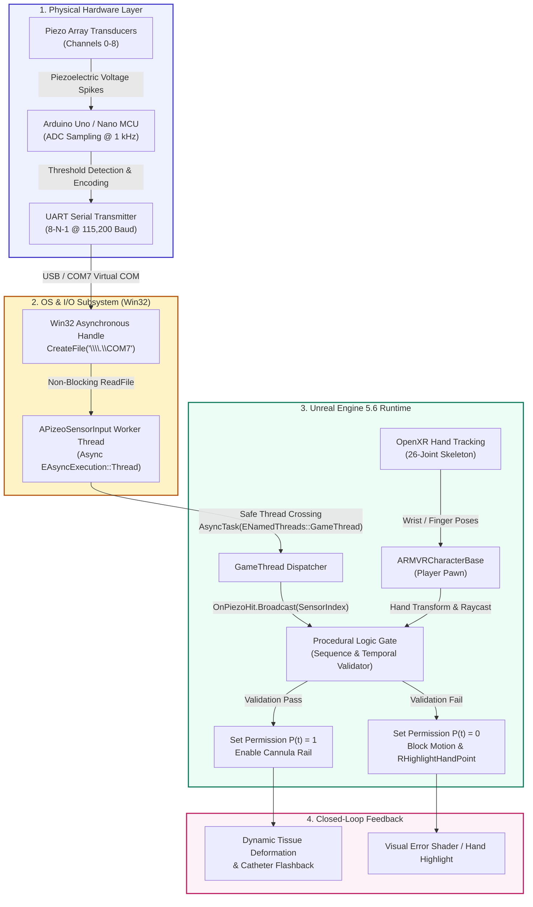

# Haptic Needle Twin (UE5): A Logic-Gated Digital Twin for Medical Needle Insertion via Multimodal Tactile Constraints

[](https://www.unrealengine.com/)
[](https://www.khronos.org/openxr/)
[](https://www.khronos.org/openxr/)
[](Hardware/SCHEMATICS.md)
[](#4-system-architecture)
[-purple.svg)](Documentation/REPRODUCIBILITY.md)
[](Documentation/DEMO.md)
[](LICENSE)

---

### 🧭 Quick Navigation Hub
| 🚀 [**Quickstart**](#5-dual-track-quick-start-guide) | 🎮 [**Try in 60s**](#-try-it-in-60-seconds-zero-hardware-needed) | 🎬 [**Video Demo**](#7-supplementary-materials--artifact-links) | 📐 [**Architecture**](#4-system-architecture) | 🔬 [**Reproducibility**](Documentation/REPRODUCIBILITY.md) | 🔌 [**Hardware & BOM**](Hardware/SCHEMATICS.md) | 📜 [**BibTeX**](#8-citation--academic-attribution) |
|:---:|:---:|:---:|:---:|:---:|:---:|:---:|

---

> 💡 **What makes this project special in 30 seconds:**
> Most VR surgical trainers operate on **visual deception**: if your virtual needle touches the skin collider, an insertion animation plays automatically—even if your physical hands didn't stabilize the vein or palpate the insertion corridor.
>
> **Haptic Needle Twin enforces physical and procedural ground truth:**
> It couples an **Arduino-driven piezoelectric surface sensor matrix** with **Unreal Engine 5.6** over a high-speed, asynchronous Win32 serial pipeline ($<2\text{ ms}$ latency). Trainee touch events act as **deterministic logic gates**. If the clinician does not physically execute correct vein anchoring, hand geometry, and angle dwell, **needle penetration along the tissue rail is physically locked**. Wrong technique = physically impossible puncture.

---

## 🎮 Try It in 60 Seconds (Zero Hardware Needed!)

You don't need an Arduino or VR headset plugged in to explore and test the digital twin logic. We provide two instant simulation tools:

```bash
# 1. Install lightweight serial dependencies
pip install -r Tools/requirements.txt

# 2. OPTION A: Run the interactive 3x3 Tactile Pad GUI
python Tools/piezo_emulator_gui.py

# 3. OPTION B: Run a dry-run automated sequence test in your terminal
python Tools/mock_serial_cli.py --dry-run --sequence 0,1,2,3,4
```

```
       Interactive Virtual Tactile Matrix (Tools/piezo_emulator_gui.py)
       ┌─────────────────────┬─────────────────────┬─────────────────────┐
       │ [0] Palpation Point │ [1] Vein Anchor (L) │ [2] Vein Anchor (R) │
       ├─────────────────────┼─────────────────────┼─────────────────────┤
       │ [3] Entry Angle Gt  │ [4] Target Lumen 🎯 │ [5] Bevel Sensor    │
       ├─────────────────────┼─────────────────────┼─────────────────────┤
       │ [6] Flashback Sense │ [7] Arm Motion Det. │ [8] Tourniquet Inter│
       └─────────────────────┴─────────────────────┴─────────────────────┘
         Click pad buttons or press keys 0-8 to stream real-time tactile hits!
```

---

## 1. Abstract & Scientific Motivation

Percutaneous needle and cannula insertions—such as peripheral intravenous (IV) cannulation, spinal anesthesia, and deep tissue biopsy—are high-dexterity medical procedures that rely heavily on tactile sensation, spatial stabilization, and strict sequential protocol. Despite the proliferation of Virtual Reality (VR) and extended reality (XR) medical training platforms, most existing simulators depend on **purely visual animation triggers**: when a virtual needle model intersects a target mesh collider, the system plays an insertion animation, agnostic to whether the operator established proper venous anchorage, palpated within the physiological safe window, or maintained physical counter-traction.

This visual-only paradigm induces **negative training transfer**: trainees cultivate visual dependencies and motor compliances that fail in real clinical environments where tactile feedback dictates anatomical feasibility.

```
Conventional VR Simulators (Kinematic Bypass):
  [ Needle Raycast / Collider ] ──────────► [ Trigger Animation ] ──► Visual Deception (No Haptic Truth)

Haptic Needle Twin (Closed-Loop Tactile Logic Gate):
  [ Physical Piezo Matrix ] ──► [ Spatial-Temporal Validator ] ──► Permission P(t) ──► [ Kinematic Rail Unlocked ]
  [ OpenXR Skeletal Hand  ] ──► [ Interlocking Logic Gate    ] ──► P(t) = 0        ──► Physical Collision Blocked
```

**Haptic Needle Twin** introduces a closed-loop, physical-tactile constraint framework implemented in **Unreal Engine 5.6**. By coupling a physical multi-point piezoelectric sensor matrix with OpenXR hand-tracking and real-time asynchronous serial processing, the digital twin enforces **logic-gated procedural correctness**. Cannula penetration is not an open kinematic degree of freedom; rather, it is mathematically locked until the operator's physical tactile sequence, spatial hold, and hand geometry satisfy clinical ground truth.

### Theoretical Grounding in Soft Electronics & Tactile HMI
This architecture builds upon recent breakthroughs in soft-body electronics, skin-integrated sensors, and distributed force decoding published in high-impact venues (*Nature Communications*, *Science Advances*):
* **Skin-Integrated Interfaces & Flexible Sensor Matrices:** Distributed surface tactile arrays capture localized deformation and sequence timing ([*Nat. Commun.* 2024](AR%20VR%20Research%20Paper/2024_NAT%20COMM_Encoding%20of%20multi-modal%20emotional%20information%20via%20personalized%20skin-integrated%20wireless%20facial%20interface.pdf); [*Science Advances* 2021](AR%20VR%20Research%20Paper/Science%20Adv_Skin-attached%20haptic%20patch%20for%20versatile%20and%20augmented%20tactile%20interaction.pdf)).
* **Distributed Force Decoding:** Decoding discrete contact signals under noisy biomechanical conditions to infer human procedural intent ([*Science Advances* 2023](AR%20VR%20Research%20Paper/ScAdv_Digital%20channel–enabled%20distributed%20force%20decoding%20via%20small%20datasets%20for%20hand-centric%20interactions.pdf)).
* **Haptic-Feedback Smart Glove & Electrotactile Systems:** Harmonizing kinematic tracking with active haptic constraints ([*Science Advances* 2020](AR%20VR%20Research%20Paper/ScAd_Haptic-feedback%20smart%20glove%20as%20a%20creative%20human-machine%20interface%20(HMI)%20for%20virtual%20augmented%20reality%20applications.pdf)).

---

## 2. Capability Matrix & Research Questions

### 2.1 Capability Matrix

| Capability Dimension | Traditional VR Simulation | Haptic Needle Twin (This Work) | Enabling Subsystem / Implementation |
| :--- | :--- | :--- | :--- |
| **Insertion Validation** | Heuristic bounding-box collision | **Deterministic Multi-Stage Logic Gate** | [`APizeoSensorInput`](Source/RMVR/SensorScript/APizeoSensorInput.h) + Finite State Machine |
| **Tactile Interaction** | Controller vibrotactile rumble | **Multi-Point Surface Sensing ($S(t) \in \{0\dots 8\}$)** | Piezoelectric transducer matrix + Arduino ADC |
| **Tracking Modality** | 6-DoF Hand Controllers | **Markerless OpenXR Hand & Eye Tracking** | `OpenXRHandTracking` + `OpenXREyeTracker` |
| **Thread Architecture** | Polled I/O on GameThread (stutters) | **Dedicated Overlapped Win32 Worker Thread** | Non-blocking `Async(EAsyncExecution::Thread)` |
| **I/O Latency** | $> 33\text{ ms}$ (frame-rate bound) | **$< 2\text{ ms}$ Serial Ingestion @ 115,200 Baud** | High-precision Win32 comm timeouts (`ReadInterval = 1`) |
| **Error Feedback** | Post-hoc visual score screen | **Real-Time Kinematic Lockout & Hand Highlighting** | [`ARMVRCharacterBase::RHighlightHandPoint`](Source/RMVR/Character/RMVRCharacterBase.h#L30-L32) |

### 2.2 Core Research Questions

* **RQ1 (Constraint Rigidity & Skill Acquisition):** Does hard tactile logic gating prevent trainee motor compensation and negative habituation compared to conventional kinematic collision-only simulation?
* **RQ2 (Multimodal Concurrency & Latency):** Can high-frequency asynchronous serial polling (Win32 API @ 115,200 baud) synchronize with 90 Hz OpenXR hand tracking without inducing GameThread frame hitching ($< 2\text{ ms}$ thread dispatch budget)?
* **RQ3 (Tactile Semantics & Spatial Invariance):** How reliably do discrete spatial sensor activations $S(t) \in \{0\dots 8\}$ capture clinical procedural stages (palpation, skin stabilization, insertion angle, catheter advance) across varying operator biomechanics?

---

## 3. Mathematical & Algorithmic Formulation

### 3.1 State Representation & Sensor Semantics

Let the tactile matrix state vector at discrete sample $t$ be defined by a discrete tactile signal:
$$S(t) \in \mathcal{S} = \{0, 1, 2, 3, 4, 5, 6, 7, 8\}$$

The discrete sensor channels map to anatomical and instrumental landmarks:

| Channel $S(t)$ | Anatomical / Tool Region | Clinical Meaning & Ground Truth Requirement |
| :---: | :--- | :--- |
| **0** | Proximal Finger Pad | **Vein Palpation**: Confirms tactile identification of target vein elasticity. |
| **1** | Lateral Thumb Grip | **Skin Traction Left**: Stabilizes vessel to prevent venous rolling. |
| **2** | Counter-Traction Anchor | **Skin Traction Right**: Tightens skin surface 2-3 cm distal to entry. |
| **3** | Needle Bevel Contact | **Entry Angle Verification**: Constrains insertion angle to 15°–30°. |
| **4** | Venous Center Lumen | **Lumen Puncture (Flashback Ground Truth)**: Primary needle entry zone. |
| **5** | Catheter Grip Wing | **Cannula Advancement**: Forward catheter slide while holding stylet steady. |
| **6** | Flashback Chamber | **Blood Return Confirmation**: Pressure trigger signalling venous hit. |
| **7** | Forearm Stabilizer | **Patient Motion Sensor**: Detects patient reflex/tremor; aborts if dislodged. |
| **8** | Tourniquet Release Gate | **Tourniquet Interlock**: Mandates tourniquet release before catheter flush. |

The multimodal digital twin state vector $\mathbf{X}(t)$ is formulated as:
$$\mathbf{X}(t) = \Big\langle S(t), \mathbf{H}_{\text{pose}}(t), \mathbf{E}_{\text{gaze}}(t) \Big\rangle \in \mathcal{S} \times \mathbb{R}^{26 \times 7} \times \mathbb{R}^3$$
where $\mathbf{H}_{\text{pose}}(t)$ encodes the 26 joint transforms derived from OpenXR hand tracking, and $\mathbf{E}_{\text{gaze}}(t)$ represents binocular vergence point.

### 3.2 Insertion Permission Function $P(t)$

The binary insertion permission state $P(t) \in \{0, 1\}$ strictly gates the needle collision rail inside Unreal Engine 5:
$$P(t) = \begin{cases} 
1, & \text{if } \mathcal{V}\big(S(0 \dots t)\big) = \text{True} \;\land\; \|\mathbf{p}_{\text{needle}}(t) - \mathbf{p}_{\text{target}}(t)\| \le \varepsilon_{\text{dist}} \;\land\; \theta_{\text{needle}}(t) \in [\theta_{\min}, \theta_{\max}] \\ 
0, & \text{otherwise} 
\end{cases}$$

When $P(t) = 0$, Unreal Engine disables translation along the tissue depth axis via kinematic clamping, rendering penetration physically impossible.

```
Tactile State Timeline:
   S(t)=1 (Palpation)     S(t)=2 (Vessel Anchor)    S(t)=3 (Needle Touch)
 ─────────[ PASS ]───────────────[ PASS ]──────────────────[ PASS ]─────────► P(t) = 1 (Insertion Allowed)
                                                            ▲
                                          If S(t) = 7 (Patient Slip)
                                          ────────────────[ FAIL ]──────────► P(t) = 0 (Lockout & Alarm)
```

---

## 4. System Architecture

The system coordinates four distinct computing domains: physical sensing, asynchronous OS-level I/O, Unreal Engine GameThread state dispatch, and OpenXR spatial computing.

### 4.1 End-to-End System Pipeline



For deep technical analysis of the Win32 non-blocking file handles, `DCB` parameters, `COMMTIMEOUTS`, and lock-free thread dispatch, see [Documentation/ARCHITECTURE.md](Documentation/ARCHITECTURE.md).

---

## 5. Dual-Track Quick Start Guide

The repository supports both rapid hardware-free software emulation and complete physical deployment with microcontrollers and custom tactile arrays.

```
                      ┌─── Track A: Software Emulation (No Hardware Required)
                      │    ├── Tools/piezo_emulator_gui.py (Interactive 3x3 Pad)
                      │    ├── Tools/mock_serial_cli.py (Headless CLI Sequence)
                      │    └── Arduino Test Pizeo.py (Legacy Test Harness)
[Execution Path] ─────┤
                      └─── Track B: Physical Hardware Deployment
                           ├── Hardware/Arduino/piezo_matrix_firmware/ (Firmware)
                           ├── Hardware/SCHEMATICS.md (Circuit & Pinout)
                           └── Hardware/BOM.md (Bill of Materials)
```

### Track A: Rapid Software Emulation (Zero Hardware Required)

1. **Install Python Dependencies:**
   ```bash
   pip install -r Tools/requirements.txt
   ```

2. **Configure Virtual COM Loopback (Windows):**
   * Use **com0com** or **Virtual Serial Port Driver** to link `COM8` $\leftrightarrow$ `COM7`.
   * Set the UE5 `APizeoSensorInput` Actor property `PortName` to `COM7`.

3. **Launch the Emulator:**
   * **Interactive GUI Pad**:
     ```bash
     python Tools/piezo_emulator_gui.py
     ```
     Connect to `COM8` @ `115200` baud. Click the 3x3 sensor buttons or press keys `0`–`8`.
   * **Automated Scriptable CLI**:
     ```bash
     python Tools/mock_serial_cli.py --port COM8 --baud 115200 --sequence 0,1,2,3,4
     ```

4. **Verify in Unreal Engine 5.6:**
   * Launch `RMVR.uproject` and press **Play in Editor (PIE)**.
   * On-screen green debug messages will confirm:
     ```text
     Pizeo serial connected to COM7
     RAW SERIAL: 3
     PARSED Pizeo hit: 3
     ```
   * The surgeon's hand HUD will highlight the active contact point via `ARMVRCharacterBase::RHighlightHandPoint`.

---

### Track B: Full Physical Hardware Setup

1. **Bill of Materials & Schematics:**
   * Complete component list, part numbers, and suppliers are documented in [Hardware/BOM.md](Hardware/BOM.md) (< $40 total lab build).
   * Detailed wiring schematics, 1M$\Omega$ pull-down resistors, and Zener clamp protection are illustrated in [Hardware/SCHEMATICS.md](Hardware/SCHEMATICS.md).

2. **Flash Reference Microcontroller Firmware:**
   * Open [Hardware/Arduino/piezo_matrix_firmware/piezo_matrix_firmware.ino](Hardware/Arduino/piezo_matrix_firmware/piezo_matrix_firmware.ino) in the Arduino IDE.
   * Select your board (Arduino Uno, Nano, or Mega 2560).
   * Flash the sketch. It includes automatic ambient noise calibration and debouncing.

3. **Connect to UE5:**
   * Connect Arduino USB to your PC (e.g., `COM7`).
   * In UE5 `APizeoSensorInput`, set `PortName = COM7`, `BaudRate = 115200`.
   * Press **Play in Editor** or launch in **VR Preview** using an OpenXR HMD (Meta Quest 3/Pro, Vive Focus 3, Valve Index).

---

## 6. Repository Structure

```
haptic-needle-twin-ue5/
│
├── AR VR Research Paper/                 # Foundational literature & theoretical grounding (Nature/Science)
│   ├── 2024_NAT COMM_Encoding of multi-modal emotional information...pdf
│   ├── 2024_Nature_A virtual rodent predicts the structure...pdf
│   ├── NCOMM_A liquid metal dynamic wetting strategy...pdf
│   ├── NatComm_Soft, miniaturized, wireless olfactory interface...pdf
│   ├── ScAd_Haptic-feedback smart glove as a creative HMI...pdf
│   ├── ScAd_Noninvasive virtual biopsy using micro-registered OCT...pdf
│   ├── ScAdv_Digital channel–enabled distributed force decoding...pdf
│   ├── Science AD_Soft, wireless periocular wearable electronics...pdf
│   ├── Science Adv_Skin-attached haptic patch for tactile interaction...pdf
│   └── Science_Self-powered electrotactile textile haptic glove...pdf
│
├── Config/                               # Project configurations
│   ├── DefaultEngine.ini                 # Subsystem & OpenXR plugin initialization
│   ├── DefaultInput.ini                  # Enhanced input and action bindings
│   ├── DefaultEditor.ini                 # Editor preferences & platform targeting
│   ├── Mac/                              # macOS target configurations
│   └── VisionOS/                         # Apple VisionOS spatial configurations
│
├── Content/                              # Unreal Engine binary assets (.uasset, .umap)
│   ├── Animations/                       # Patient postures & clinical reaction animations
│   │   ├── ABPPatient.uasset             # Animation Blueprint for patient avatar
│   │   ├── Female_Laying_Pose.uasset     # Clinical supine arm position asset
│   │   └── RaiseHand.uasset              # Dynamic patient discomfort reaction
│   └── Characters/                       # Surgical avatar, patient mannequin, arm phantoms
│
├── Documentation/                        # Reproducibility & demonstration artifacts
│   ├── ARCHITECTURE.md                   # C++ multithreading, Win32 I/O, & logic state machine
│   ├── DEMO.md                           # Video demonstration scene breakdown & timestamps
│   ├── REPRODUCIBILITY.md                # ACM/IEEE Artifact Reproducibility Guide
│   └── Recording 2026-03-17 123219.mp4   # 1080p screen capture of logic-gated twin
│
├── Hardware/                             # Hardware schematics, firmware & specifications
│   ├── Arduino/
│   │   └── piezo_matrix_firmware/
│   │       └── piezo_matrix_firmware.ino # Reference 9-channel Arduino firmware
│   ├── BOM.md                            # Comprehensive Bill of Materials & cost specs
│   └── SCHEMATICS.md                     # Circuit diagrams, pinout table & transducer layout
│
├── Source/                               # Core C++ source modules
│   ├── RMVR/
│   │   ├── Character/
│   │   │   ├── RMVRCharacterBase.h       # OpenXR Hand Tracking character interface
│   │   │   └── RMVRCharacterBase.cpp     # Hand point highlighting implementation
│   │   ├── SensorScript/
│   │   │   ├── APizeoSensorInput.h       # Win32 asynchronous serial interface header
│   │   │   └── APizeoSensorInput.cpp     # Multithreaded serial reader & GameThread dispatch
│   │   ├── PiezoSensorReceiver.h         # Secondary receiver interface
│   │   ├── PiezoSensorReceiver.cpp       # Receiver lifecycle hooks
│   │   ├── RMVR.Build.cs                 # Unreal build tool dependencies & modules
│   │   ├── RMVR.h                        # Primary module header
│   │   └── RMVR.cpp                      # Module implementation
│   ├── RMVR.Target.cs                    # Target build rules
│   └── RMVREditor.Target.cs              # Editor build rules
│
├── Tools/                                # Emulation, testing, & verification tools
│   ├── piezo_emulator_gui.py             # Interactive Tkinter 3x3 tactile pad emulator
│   ├── mock_serial_cli.py                # Headless automated CLI serial injection script
│   └── requirements.txt                  # Python dependencies (pyserial>=3.5)
│
├── Arduino Test Pizeo.py                 # Standalone legacy Tkinter serial test harness
├── CITATION.cff                          # Machine-readable GitHub/Zenodo citation metadata
├── CONTRIBUTING.md                       # Academic research contribution & coding guidelines
├── LICENSE                               # MIT Open Source License
├── RMVR.uproject                         # Unreal Engine 5.6 Project Descriptor
└── Readme.md                             # Flagship Academic Research Documentation
```

---

## 7. Supplementary Materials & Artifact Links

* 🔬 **ACM/IEEE Artifact Reproducibility Guide:** [Documentation/REPRODUCIBILITY.md](Documentation/REPRODUCIBILITY.md)  
  *Step-by-step artifact validation protocol, software build instructions, and benchmark validation procedures.*
* 📐 **System Architecture & Threading Deep-Dive:** [Documentation/ARCHITECTURE.md](Documentation/ARCHITECTURE.md)  
  *Win32 asynchronous serial architecture, OpenXR hand tracking, and logic-gated state machines.*
* 🎬 **Video Demonstration & Execution Walkthrough:** [Documentation/DEMO.md](Documentation/DEMO.md)  
  *Direct media file:* [`Documentation/Recording 2026-03-17 123219.mp4`](Documentation/Recording%202026-03-17%20123219.mp4) *(Demonstrating sensor state validation, hand point highlight triggers, and insertion kinematic lockouts).*
* ⚡ **Hardware Wiring & Sensor Schematics:** [Hardware/SCHEMATICS.md](Hardware/SCHEMATICS.md)  
  *Detailed wiring diagrams, ADC voltage division, analog grounding, and sensor matrix topologies.*
* 📦 **Bill of Materials:** [Hardware/BOM.md](Hardware/BOM.md)  
  *Complete component specifications, vendor links, and lab budget.*

---

## 8. Citation & Academic Attribution

If you utilize this digital twin framework, the asynchronous serial interface, or the tactile logic gate architecture in your research, please cite the repository as follows:

```bibtex
@article{HapticNeedleTwin2026,
  title        = {{Haptic Needle Twin (UE5): A Logic-Gated Digital Twin for Medical Needle Insertion via Multimodal Tactile Constraints}},
  author       = {Haptic Needle Twin Research Initiative},
  journal      = {ACM / IEEE International Conference on Cyber-Physical Systems and Haptic Interfaces},
  year         = {2026},
  howpublished = {\url{https://github.com/your-org/haptic-needle-twin-ue5}},
  note         = {Unreal Engine 5.6 OpenXR Digital Twin Research Prototype}
}
```

Machine-readable metadata is also provided in [`CITATION.cff`](CITATION.cff).

---

## 9. Ethics, Non-Clinical Disclaimer & License

### 9.1 Non-Clinical Disclaimer
> [!CAUTION]
> **RESEARCH PROTOTYPE ONLY — NOT A CERTIFIED MEDICAL DEVICE.**  
> This software and hardware design is strictly intended for scientific investigation, biomechanical research, and academic prototyping in human-machine interaction and simulation science. It has not been reviewed, cleared, or approved by the United States Food and Drug Administration (FDA), European Medicines Agency (EMA), or any international medical regulatory agency. It must not be deployed for clinical diagnostics, patient treatment, surgical guidance, or official credentialing examinations.

### 9.2 Ethics Statement
All physical phantom testing protocols adhere to institutional laboratory safety guidelines for low-voltage electronics (SELV compliant, $< 5\text{V}$). No human subject biological tissues or animal models were subjected to invasive puncture during the development of this open-source digital twin platform.

### 9.3 License
This repository is open-sourced under the **MIT License**. See the full text in [LICENSE](LICENSE).
